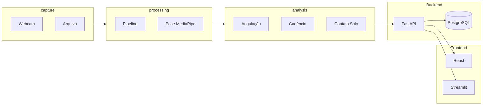

# Arquitetura do Projeto Runners

## Visão geral

O sistema de monitoramento biomecânico de corrida segue um fluxo **captura → processamento → análise → API → persistência e frontends**.

## Componentes

| Componente | Descrição |
|------------|-----------|
| **capture** | Fontes de vídeo: webcam (OpenCV `VideoCapture`) ou arquivo. Abstração comum: `read()` / `frames()`. |
| **processing** | Converte frame BGR → RGB, executa MediaPipe Pose, desenha esqueleto e retorna landmarks normalizados. |
| **analysis** | Cálculo de ângulos (joelho, quadril, tronco), tempo de contato com o solo (GCT), cadência e distância. |
| **api** | FastAPI: health check, endpoint de métricas (stub ou real), CRUD de sessões. Persistência em PostgreSQL. |
| **frontend** | React: dashboard com cards de métricas e placeholder para vídeo. Streamlit: prototipagem com seleção de fonte e exibição de métricas. |

## Fluxo de dados

1. **Vídeo** é lido por `src/capture` (webcam ou arquivo).
2. Cada **frame** é passado ao **pipeline** (`src/processing`), que retorna frame anotado e lista de landmarks.
3. Os **landmarks** são usados por `src/analysis` para calcular ângulos (por frame) e métricas de marcha (por sequência de frames).
4. A **API** expõe métricas e sessões; o **React** consome a API (fetch ou, no futuro, WebSocket) e o **Streamlit** pode rodar o pipeline localmente para prototipagem.

## Configuração

Arquivos em `config/` (ex.: `default.yaml`) definem câmera, parâmetros do MediaPipe e métricas habilitadas. O loader em `src/utils/config_loader.py` carrega esses arquivos.

## Deploy

- **Local:** venv, PostgreSQL (ou só `db` via Docker), `uvicorn api.main:app`, `streamlit run streamlit_app/app.py`, `npm run dev` no frontend.
- **Docker:** `docker-compose up` sobe db, api e streamlit; o frontend pode ser servido por um servidor estático ou dev server fora do compose.
